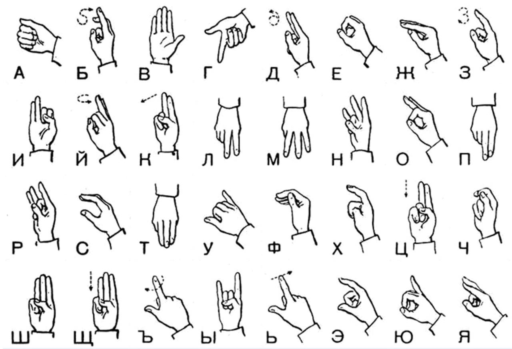
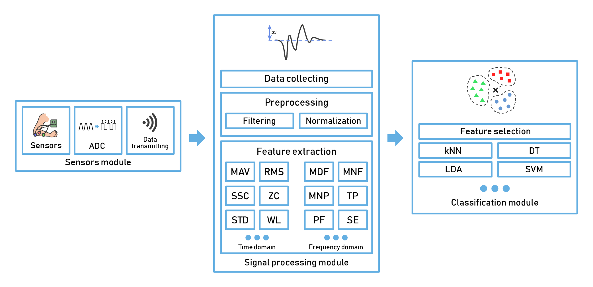
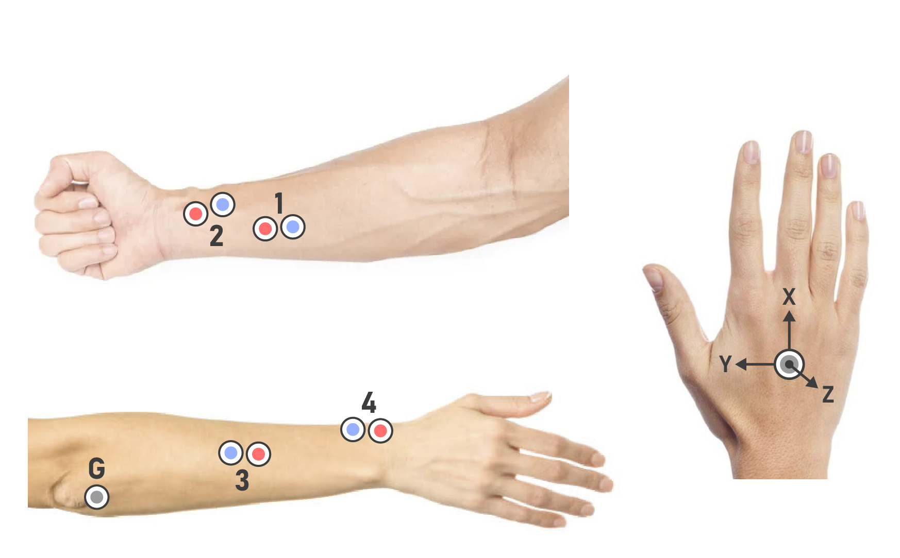
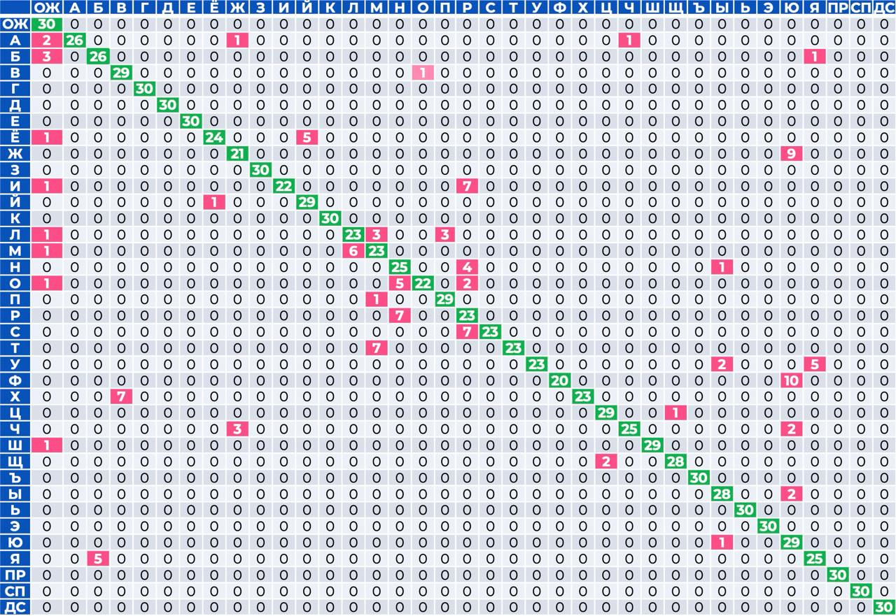
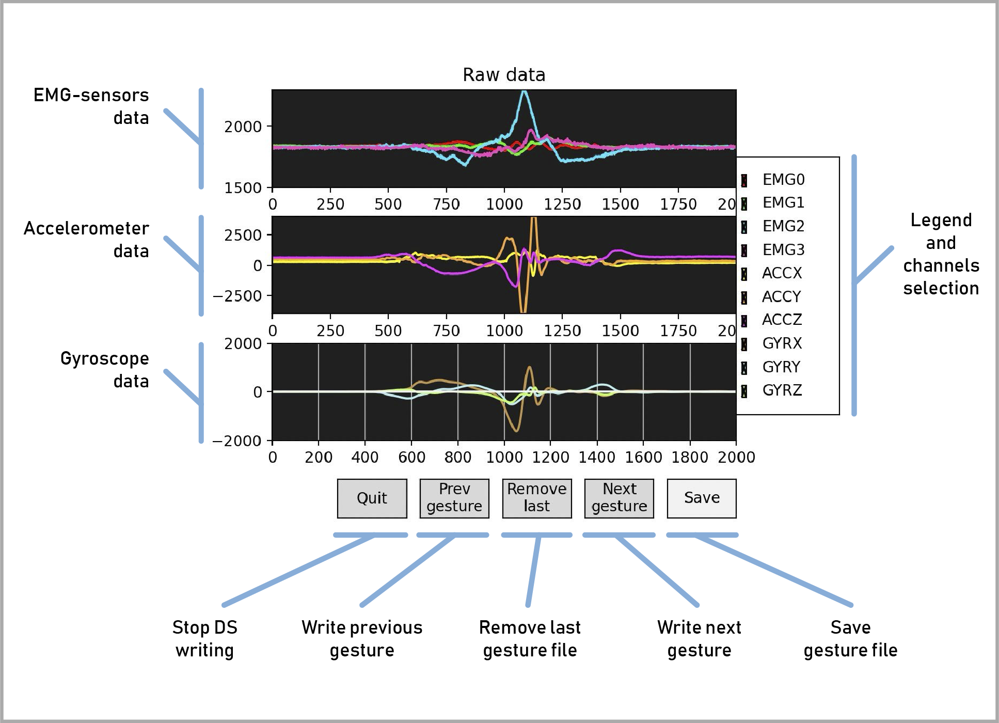
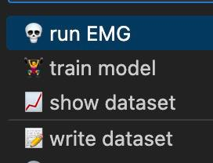

# Russian Sign Language Gesture Recognition System

This master's degree project is about creating a system to recognize Russian Sign Language (RSL) gestures using EMG sensors and inertial sensor data. The dataset includes the RSL dactyl alphabet and basic phrases like "Привет" (Hello), "Спасибо" (Thanks), and "До свидания" (Goodbye).

**RSL Dactyl Alphabet:**

## Table of Contents

1. [Project Overview](#project-overview)
2. [System Architecture](#system-architecture)
3. [Hardware Components](#hardware-components)
4. [Data Collection](#data-collection)
5. [Data Processing](#data-processing)
6. [Machine Learning Models](#machine-learning-models)
7. [Results](#results)
8. [Conclusion](#conclusion)
9. [Scripts Overview](#scripts-overview)
10. [Configuration](#configuration)
11. [Running the Project](#running-the-project)
12. [STM32 Submodule](#stm32-submodule)
13. [Contributions](#contributions)

## Project Overview

The goal of this project is to develop a system that can accurately recognize gestures from the Russian Sign Language using signals from EMG and inertial sensors. The system processes these signals to extract meaningful features and classifies them using machine learning models.

## System Architecture

The system is divided into three main modules:

- **Sensor Module**: Consists of the **STM32F103RB Nucleo** board and the sensors.
- **Signal Processing Module**: Includes preprocessing and feature extraction from time and frequency domains.
- **Classification Module**: Involves training and using machine learning models for gesture recognition.

### Sensors Module

- **STM32F103RB Board**: *([FW source repo](https://github.com/nktsb/EMG-sensors-stm32))*
- **Grove-EMG Sensors**: *4 pcs.*
- **MPU6050 Sensor**: *Accelerometer + Gyroscope.*

### Data Processing Module

#### Preprocessing

1. **Normalization**: *Max-min normalization with static levels*
2. **Filtering**: *Band-Pass and Low-Pass Butterworth filters*

#### Feature Extraction

Features are extracted from both time and frequency domains.

##### Time Domain Features:
- Energy (EN)
- Mean Absolute Value (MAV)
- Mean Absolute Deviation (MAD)
- Waveform Length (WL)
- Standard Deviation (STD)
- Slope Sign Change (SSC)
- Zero Crossing (ZC)
- Root Mean Square (RMS)
- Number of Peaks (NP)
- Skewness (SKEW)
- Kurtosis (KURT)
- Variance (VAR)
- Wilson Amplitude (WA)
- Percentile (PERC)
- Integral Absolute Value (IAV)

##### Frequency Domain Features:
- Mean Frequency (MNF)
- Median Frequency (MDF)
- Mean Power (MNP)
- Total Power (TTP)
- Peak Frequency (PKF)
- Spectral Entropy (SE)
- Frequency Ratio (FR)
- Power Spectrum Ratio (PSR)

### Classification Module

#### Feature Selection:

Features are selected by **correlation matrix** and **mutual information** method.

#### Machine Learning Models

Multiple machine learning models were trained using the extracted features:

- K-Nearest Neighbors (KNN)
- Support Vector Machine (SVM)
- Linear Discriminant Analysis (LDA)
- Decision Tree (DT)
- Gradient Boosting (GB)
- Random Forest (RF)
- Naive Bayes (NB)

## Experiment

### Training Data Collection

The dataset was recorded over three sessions, each separated by a day. For each gesture, 125 files were recorded, divided into 80% for training and 20% for testing.

### Sensor Placement

- **EMG Sensors *(muscles)***:
  - Surface Flexor Digitorum
  - Long Flexor of the Thumb
  - Finger Extensor
  - Short Extensor of the Thumb

- **Inertial Sensor**:
  - Outer side of the hand

### Models Performance

All models were trained and tested on the test dataset (20% of the total dataset). There are accuracy metrics values below:

| Model            | Accuracy |
|------------------|----------|
| Decision Tree    | 0.983    |
| Gradient Boosting| 0.994    |
| KNN              | 0.965    |
| **LDA**              | **0.996**    |
| Naive Bayes      | 0.989    |
| Random Forest    | 0.994    |
| SVM              | 0.991    |

The **LDA** model, having the highest accuracy, was selected for real-time testing.

## Results

For each gesture, 30 repetitions were recorded, resulting in a confusion matrix.

### Confusion matrix

Real-time metrics values:

| Metric    | Value |
|-----------|-------|
| Accuracy  | 0.994 |
| Recall    | 0.889 |
| Precision | 0.91  |
| F1 Score  | 0.892 |

## Conclusion

The results indicate a high accuracy of 0.994 in gesture recognition. Notably, the inertial sensor had the greatest impact on classification performance, while the EMG sensor was found to be less significant. This suggests that, although the EMG data contributes to the overall system, it may not provide the robust information needed for reliable classification.

## Scripts Overview

### **write_dataset.py**: 
*Records dataset.*
  - Opens a matplotlib window for sensor data visualization
  - Allows for gesture selection, file saving, and deletion

### **show_dataset.py**: 
*Views recorded dataset files.*
  - Matplotlib visualization with gesture and file navigation

### **train_model.py**:
*Trains machine learning models on the writed dataset.*
  - Saves model info file
  - Saves .pkl model file
  - Saves .csv file with confusion matrix and performance metrics

### **run_emg.py**:
*Real-time gesture recognition.*
  - Displays sensor data using matplotlib.
  - Outputs recognized gesture and confidence score.

## Configuration

System parameters, including filters settings, features parameters, gestures set, sampling rate, data channels, model file, etc. are defined in `emg_parameters.json`.

## Running the Project

This project is configured to be run in Visual Studio Code (VSCode). Each script has a corresponding task in `tasks.json`, which runs the script through `main.sh`. The `main.sh` script sets up a virtual environment with all necessary modules specified in `requirements.txt`.

### Tasks in VSCode

### Steps to Run

1. **Install Python@3.12**: It doesn't work with eralier versions.
2. **Open VSCode**: Open the project folder in VSCode.
3. **Configure System**: Edit `emg_parameters.json` as needed.
4. **Run Task**: From the VSCode menu, go to `Terminal > Run Task`, and choose the desired task.

The list of tasks configured in VSCode:

## STM32 Firmware

The project includes a submodule for the STM32 Firmware source, which handles sensor data acquisition and transmission. You can find the repo [here](https://github.com/nktsb/EMG-sensors-stm32).
